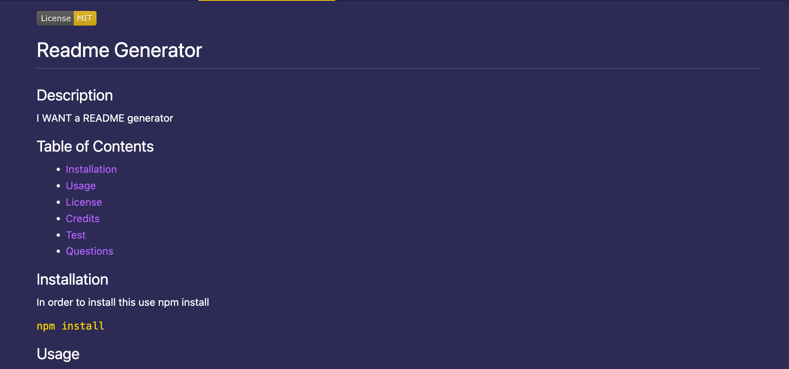

  

  # Readme Generator

## Description

In this project I learned how to use node.js to create a readme generator.

## Table of Contents 

- [Installation](#installation)
- [Usage](#usage)
- [License](#license)
- [Credits](#credits)
- [Test](#test)
- [Questions](#questions)

## Installation

In order to install this the code below in your command line.

`npm install`

## Usage

Please be kind I am only a junior developer :).

See a screenshot below of my work!
   

# Live Link to video of work: [Video](https://drive.google.com/file/d/1vbApaM9_98wTOovrikS9-mzYnYs1XaW2/view)
   
## License 

    This project is licensed under MIT.

## Credits

List your collaborators, if any, with links to their GitHub profiles.

If you wish to see my work you can view my github at https://github.com/kaitdiaz01.

## Test

If you wish to run tests use the command below

Use `npm test`

## Questions

If you have any questions contact me at katediaz011@gmail.com.
